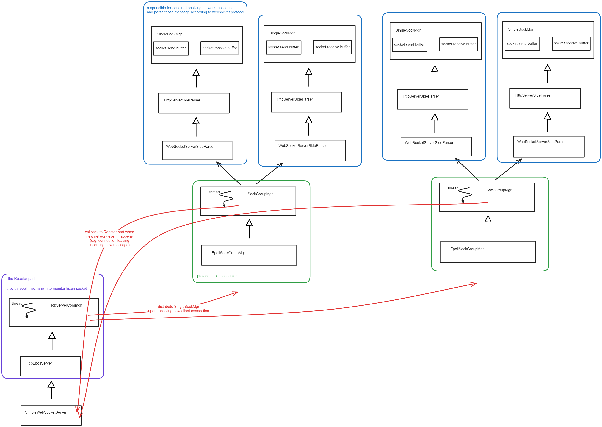

### 简介
这是一个简单的支持 websocket 协议的服务端架构

项目图如下

该架构采用 epoll 网络模型，由一个 reactor 以及多个工作线程组成，reactor 的部分由图中左边的 TcpServerCommon, TcpEpollServer, SimpleWebSocketServer 三部分组成，工作线程部分由图中右边的 EpollSockGroupMgr, SockGroupMgr, WebSocketServerSideParser, HttpServerSideParser, SingleSockMgr 组成
代码整体采用模板模式编写：在 reactor 的部分中， TcpServerCommon 是骨架，提供了大部分服务端服务，包括创建 listen socket, bind, listen, 创建 reactor 线程和工作线程等，reactor 会不断地监听 listen socket IO 事件，而监听函数所采用的 epoll 模型由 TcpEpollServer 提供；当有新的 connection socket 加入时，reactor 线程会均匀分配给工作线程，每个工作线程由 SockGroupMgr 管理，一个 SockGroupMgr 会管理多个 connection socket，而每一个 connection socket 又由 SingleSockMgr 管理。
工作线程的部分仍然是模板模式：SingleSockMgr 完成了对单一 connection socket 的大部分管理工作，包括处理读写缓冲区以及提供消息解析相关的接口，HttpServerSideParser 和 WebSocketServerSideParser 会根据自身的协议去具体实现缓冲区数据的解析函数；SockGroupMgr 完成了属于自己的全部 connection socket 的大部分管理工作，包括监听 IO 事件、检查心跳、将相应的 IO 事件通过回调函数通知 reactor 部分进行处理，而 EpollSockGroupMgr 为 SockGroupMgr 的监听动作提供具体的 epoll 模型。
SockGroupMgr 给 reactor 部分的回调会最终通过 SimpleWebSocketServer 调用用户注入的回调函数。

### 使用说明
用户应与 SimpleWebSocketServer 进行交互，首先应将自己编写的回调函数注入 SimpleWebSocketServer 的 on_client_leave, on_client_join, on_websock_msg 然后依次调用 InitSocket, Bind, Listen 来初始化 listen socket, 然后调用 Start 来创建 reactor 线程以及工作线程，reactor 线程会监听是否有新的客户端加入，并且将相应的客户端分配给工作线程，工作线程会监听 connection socket 的 IO 事件，并且在发生相关事件时回调到 SimpleWebSocketServer 里面相应的用户回调函数里面